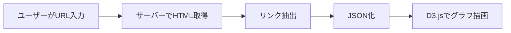

## ジャンル
ハウツー / Webサービス紹介 / 開発アイデア 💻✨

## はじめに
「あるWebページのURLを入力すると、そのページ内にあるリンクを**Obsidianのグラフビュー**のように可視化したい！」  
そんなニーズを持っている方に向けて、既存のサービスと自作アプリの実現方法を解説します。🌐🔗

---

## 既存のWebサービスでリンク可視化はできる？
### 代表的なサービス例
- **Graph Commons** 🕸️  
  データやリンク構造をノード＆エッジで表現できるプラットフォーム。
- **Gephi** 🧩  
  ローカルアプリだが、リンク関係を強力に可視化可能。
- **WebGraphviz** 📊  
  URLを直接解析するのではなく、Graphviz形式の入力を可視化できる。
- **ブラウザ拡張機能** 🔍  
  ChromeやFirefoxのアドオンに、ページ内リンクを抽出＆グラフ化するタイプが存在。

👉 ただし「URLを入れるだけでObsidian風のグラフが即出る」専用のWebサイトはあまり一般的ではありません。

---

## 自作Webアプリで実現するには？
### 必要なステップ
1. **リンク抽出処理** 🔗  
   - JavaScriptで指定URLのHTMLを取得（CORS制約があるため、サーバー経由でフェッチする必要あり）。
   - DOMパーサーで`<a>`タグを抽出。

2. **データ構造化** 📑  
   - ノード（ページやリンク先）とエッジ（リンク関係）をJSON形式に整理。
   - 例：
     ```json
     {
       "nodes": ["index.html", "about.html", "contact.html"],
       "edges": [["index.html", "about.html"], ["index.html", "contact.html"]]
     }
     ```

3. **可視化ライブラリを利用** 🎨  
   - D3.js → 自由度が高く、Obsidian風グラフも可能。  
   - Cytoscape.js → ネットワーク可視化に特化。  
   - vis.js → ノード間リンクを直感的に描画。

4. **UI実装** 💡  
   - URL入力フォームを設置。  
   - 「解析」ボタンを押すとリンク構造がグラフ表示される仕組み。

---

## 実装イメージ（フロントエンド構成）
- **index.html** → 入力フォーム & 描画領域  
- **style.css** → グラフビューを整えるデザイン  
- **script.js** → URL入力 → サーバー経由でHTML取得 → リンク抽出 → D3.jsで描画  
mermaid
flowchart LR
A[ユーザーがURL入力] --> B[サーバーでHTML取得]
B --> C[リンク抽出]
C --> D[JSON化]
D --> E[D3.jsでグラフ描画]



## まとめ
- 🌟 「Obsidian風リンク可視化Webサービス」はニッチだが存在する（ただし多くはカスタム用途）。
- 🚀 自作するなら リンク抽出 + グラフ描画ライブラリ の組み合わせで十分実現可能。
- 🛠️ 初期はローカルHTMLファイル解析から始めると開発がスムーズ。


※この記事はChatGPTの回答を基に作成しています。